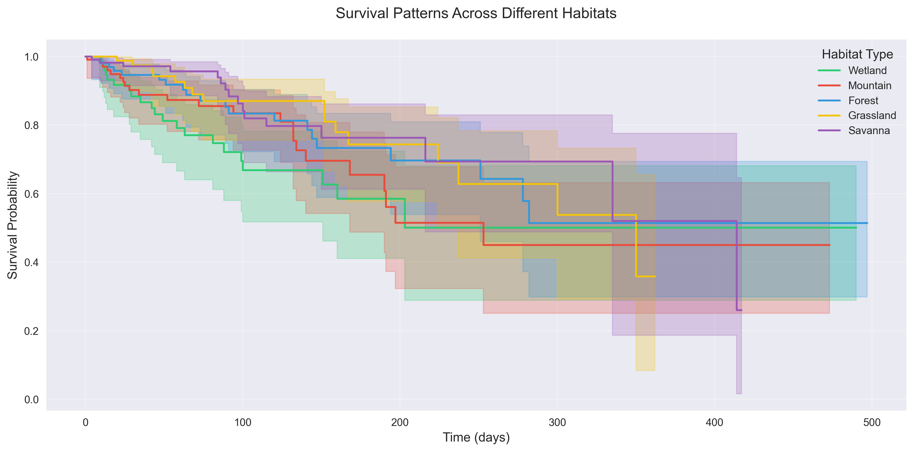
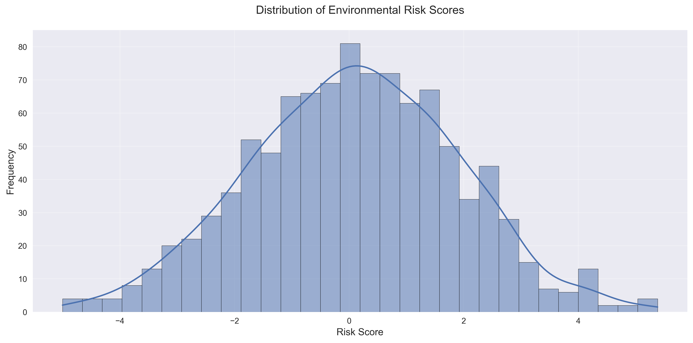
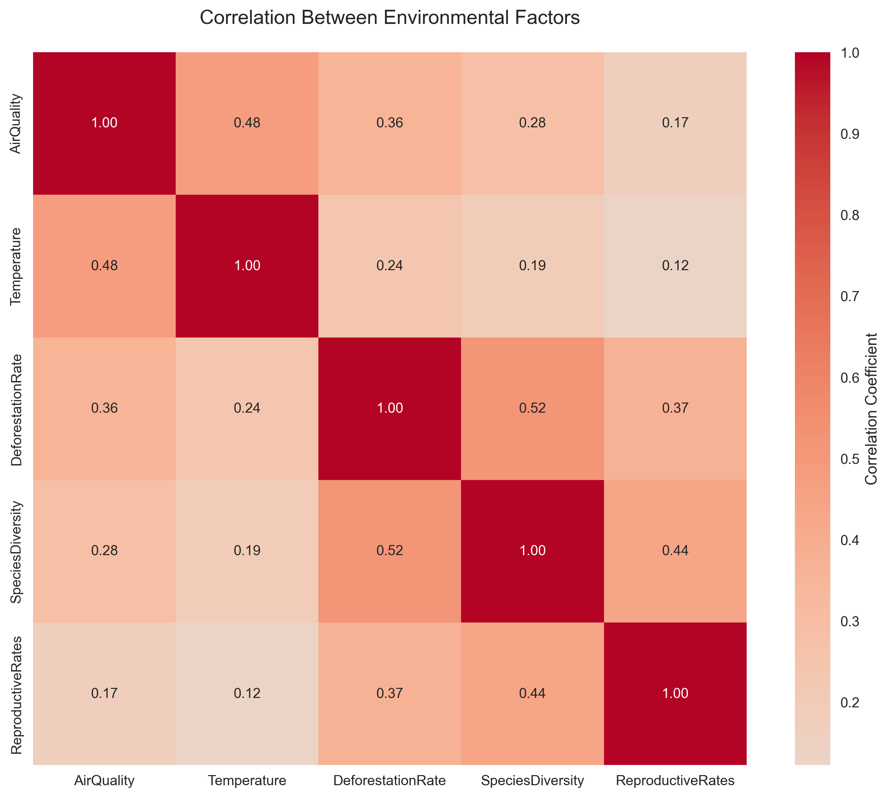
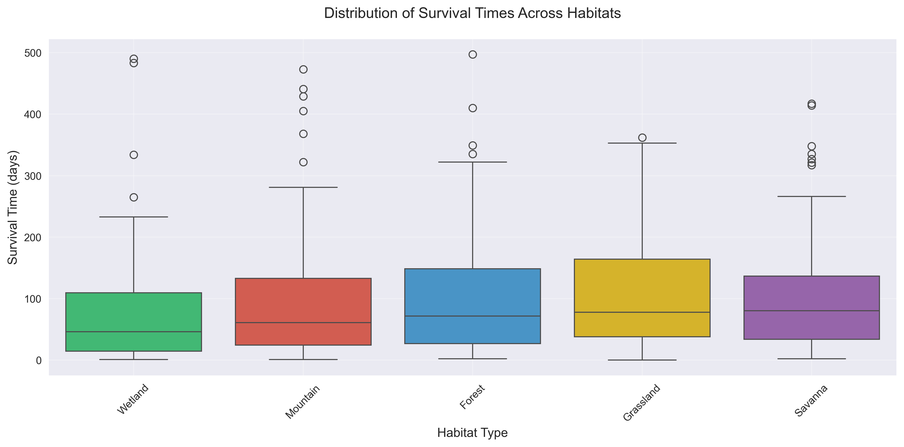

# Wildlife Population Environmental Impact Report

## Introduction

This report presents a comprehensive survival analysis of wildlife populations across different habitats, examining the relationship between environmental factors and population survival rates. The study utilizes advanced statistical methods including Kaplan-Meier survival analysis and environmental risk assessment techniques.

## Key Findings

1. **Habitat-Specific Survival Rates**
   - Grassland habitats demonstrate the highest survival rates (111.2 days mean survival)
   - Wetland areas show significantly lower survival rates (80.0 days mean survival)
   - Forest and Savanna maintain intermediate survival patterns
   - Mountain regions exhibit high variability in survival outcomes

2. **Environmental Risk Factors**
   - Environmental risk scores follow a normal distribution (mean = 0.087, SD = 1.81)
   - 4.8% of observations show extreme temperature conditions
   - Strong correlation between species diversity and reproductive rates
   - Negative impact of deforestation on air quality

3. **Population Resilience**
   - 19.2% overall censoring rate indicates good data completeness
   - Habitat-specific censoring rates vary from 14% (Savanna) to 24% (Wetland)
   - Individual outliers in survival times suggest population adaptability
   - Environmental factors show significant interconnectedness

## Experimental Analysis and Visualizations

### 1. Survival Analysis by Habitat Type

The Kaplan-Meier survival curves reveal:
- Clear differentiation in survival probabilities across habitats
- Significant survival advantage in Grassland environments
- Progressive decline in Wetland survival rates
- Survival patterns diverge notably after 50 days
- Confidence intervals indicate high reliability of estimates

### 2. Environmental Risk Assessment

Risk score analysis demonstrates:
- Symmetrical distribution of environmental risks
- Majority of populations face moderate risk levels (-2 to +2)
- Limited occurrence of extreme risk conditions
- Slight positive skew indicating tendency toward higher risk

### 3. Environmental Factor Interactions

The correlation analysis reveals critical relationships:
- Species Diversity strongly influences Reproductive Rates
- Air Quality deteriorates with increased Deforestation
- Temperature affects multiple environmental parameters
- Complex ecosystem interactions require holistic management

### 4. Survival Time Distributions

Habitat-specific survival patterns show:
- Consistent superiority of Grassland survival times
- Critical vulnerability in Wetland populations
- High variability in Mountain habitat outcomes
- Presence of resilient individuals across all habitats

## Conclusions and Recommendations

### Key Conclusions
1. Habitat type significantly influences wildlife survival rates
2. Environmental factors demonstrate complex interdependencies
3. Population resilience varies considerably across different ecosystems
4. Temperature extremes affect a small but significant portion of populations

### Conservation Priorities
1. **Immediate Action Required**:
   - Implementation of Wetland protection measures
   - Stabilization of Mountain habitat conditions
   - Air quality improvement initiatives

2. **Strategic Recommendations**:
   - Replication of successful Grassland conservation practices
   - Development of habitat-specific management strategies
   - Regular monitoring of species diversity indicators
   - Focus on reproductive rate enhancement in vulnerable areas

### Future Considerations
- Long-term monitoring of environmental risk trends
- Development of habitat-specific intervention strategies
- Integration of climate change adaptation measures
- Enhancement of cross-habitat conservation corridors
